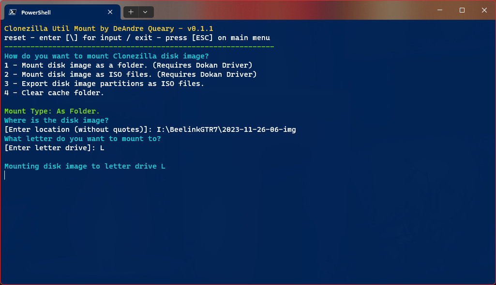

# Clonezilla-Util-Mount
 Interactive script for mounting Clonezilla images with Clonezilla Util.

# Requirements
* Windows PowerShell
* You MUST have [clonezilla-util](https://github.com/fiddyschmitt/clonezilla-util).
* [Dokan driver](https://github.com/dokan-dev/dokany/releases/tag/v2.0.6.1000) is required for mounting disk images as folders or ISO files.

# Installation
1. Copy `clonezilla-mount.ps1` into the `clonezilla-util` folder or whereever `clonezilla-util.exe` is located.
2. Open `clonezilla-mount.ps1` in PowerShell.

# Credits
This is just a wrapper for Clonezilla Util created by [fiddyschmitt](https://github.com/fiddyschmitt).

Special thanks to the [Dokany](https://github.com/dokan-dev/dokany/) team for creating the driver that powers Clonezilla-Util.